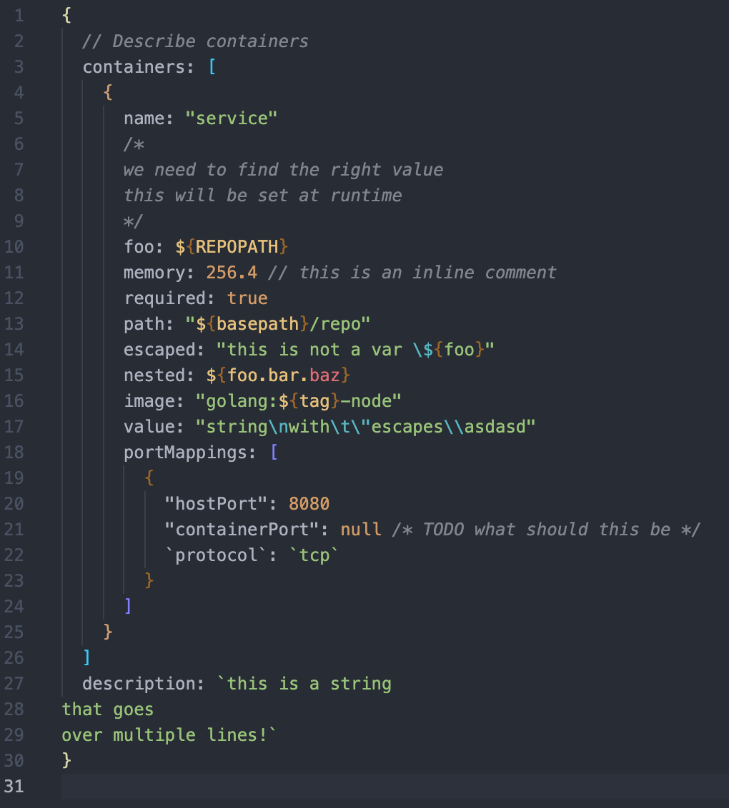
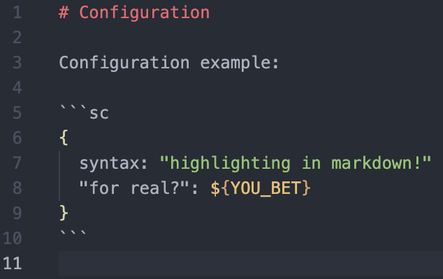

# SC support for VS Code.

The VS Code SC extension provides support for the Simple Config language.

## Features

This extension provides syntax highlighting in `.sc` files.

Syntax highlighting is also provided for SC code blocks in markdown files.

